```mermaid
flowchart TB
    subgraph upstream["Dependants (1)"]
        P1["<b>📦&nbsp;DotnetSitemapGenerator.Tests.csproj</b><br/><small>netcoreapp3.1</small>"]
        click P1 "#testdotnetsitemapgeneratortestsdotnetsitemapgeneratortestscsproj"
    end
    subgraph current["DotnetSitemapGenerator.csproj"]
        MAIN["<b>📦&nbsp;DotnetSitemapGenerator.csproj</b><br/><small>netstandard2.0</small>"]
        click MAIN "#srcdotnetsitemapgeneratordotnetsitemapgeneratorcsproj"
    end
    P1 --> MAIN

```

```mermaid
flowchart TB
    subgraph upstream["Dependants (1)"]
        P2["<b>📦&nbsp;DotnetSitemapGenerator.Website.csproj</b><br/><small>netcoreapp3.1</small>"]
        click P2 "#testdotnetsitemapgeneratorwebsitedotnetsitemapgeneratorwebsitecsproj"
    end
    subgraph current["DotnetSitemapGenerator.Tests.csproj"]
        MAIN["<b>📦&nbsp;DotnetSitemapGenerator.Tests.csproj</b><br/><small>netcoreapp3.1</small>"]
        click MAIN "#testdotnetsitemapgeneratortestsdotnetsitemapgeneratortestscsproj"
    end
    subgraph downstream["Dependencies (1"]
        P3["<b>📦&nbsp;DotnetSitemapGenerator.csproj</b><br/><small>netstandard2.0</small>"]
        click P3 "#srcdotnetsitemapgeneratordotnetsitemapgeneratorcsproj"
    end
    P2 --> MAIN
    MAIN --> P3

```

```mermaid
flowchart TB
    subgraph current["DotnetSitemapGenerator.Website.csproj"]
        MAIN["<b>📦&nbsp;DotnetSitemapGenerator.Website.csproj</b><br/><small>netcoreapp3.1</small>"]
        click MAIN "#testdotnetsitemapgeneratorwebsitedotnetsitemapgeneratorwebsitecsproj"
    end
    subgraph downstream["Dependencies (1"]
        P1["<b>📦&nbsp;DotnetSitemapGenerator.Tests.csproj</b><br/><small>netcoreapp3.1</small>"]
        click P1 "#testdotnetsitemapgeneratortestsdotnetsitemapgeneratortestscsproj"
    end
    MAIN --> P1

```

# Projects and dependencies analysis

This document provides a comprehensive overview of the projects and their dependencies in the context of upgrading to .NETCoreApp,Version=v10.0.

## Table of Contents

- [Executive Summary](#executive-Summary)
  - [Highlevel Metrics](#highlevel-metrics)
  - [Projects Compatibility](#projects-compatibility)
  - [Package Compatibility](#package-compatibility)
  - [API Compatibility](#api-compatibility)
- [Aggregate NuGet packages details](#aggregate-nuget-packages-details)
- [Top API Migration Challenges](#top-api-migration-challenges)
  - [Technologies and Features](#technologies-and-features)
  - [Most Frequent API Issues](#most-frequent-api-issues)
- [Projects Relationship Graph](#projects-relationship-graph)
- [Project Details](#project-details)

  - [src\DotnetSitemapGenerator\DotnetSitemapGenerator.csproj](#srcdotnetsitemapgeneratordotnetsitemapgeneratorcsproj)
  - [test\DotnetSitemapGenerator.Tests\DotnetSitemapGenerator.Tests.csproj](#testdotnetsitemapgeneratortestsdotnetsitemapgeneratortestscsproj)
  - [test\DotnetSitemapGenerator.Website\DotnetSitemapGenerator.Website.csproj](#testdotnetsitemapgeneratorwebsitedotnetsitemapgeneratorwebsitecsproj)

## Executive Summary

### Highlevel Metrics

| Metric | Count | Status |
| :--- | :---: | :--- |
| Total Projects | 3 | All require upgrade |
| Total NuGet Packages | 11 | 2 need upgrade |
| Total Code Files | 70 |  |
| Total Code Files with Incidents | 3 |  |
| Total Lines of Code | 3693 |  |
| Total Number of Issues | 6 |  |
| Estimated LOC to modify | 0+ | at least 0.0% of codebase |

### Projects Compatibility

| Project | Target Framework | Difficulty | Package Issues | API Issues | Est. LOC Impact | Description |
| :--- | :---: | :---: | :---: | :---: | :---: | :--- |
| [src\DotnetSitemapGenerator\DotnetSitemapGenerator.csproj](#srcdotnetsitemapgeneratordotnetsitemapgeneratorcsproj) | netstandard2.0 | 🟢 Low | 3 | 0 |  | ClassLibrary, Sdk Style = True |
| [test\DotnetSitemapGenerator.Tests\DotnetSitemapGenerator.Tests.csproj](#testdotnetsitemapgeneratortestsdotnetsitemapgeneratortestscsproj) | netcoreapp3.1 | 🟢 Low | 1 | 0 |  | ClassLibrary, Sdk Style = True |
| [test\DotnetSitemapGenerator.Website\DotnetSitemapGenerator.Website.csproj](#testdotnetsitemapgeneratorwebsitedotnetsitemapgeneratorwebsitecsproj) | netcoreapp3.1 | 🟢 Low | 0 | 0 |  | AspNetCore, Sdk Style = True |

### Package Compatibility

| Status | Count | Percentage |
| :--- | :---: | :---: |
| ✅ Compatible | 9 | 81.8% |
| ⚠️ Incompatible | 2 | 18.2% |
| 🔄 Upgrade Recommended | 0 | 0.0% |
| ***Total NuGet Packages*** | ***11*** | ***100%*** |

### API Compatibility

| Category | Count | Impact |
| :--- | :---: | :--- |
| 🔴 Binary Incompatible | 0 | High - Require code changes |
| 🟡 Source Incompatible | 0 | Medium - Needs re-compilation and potential conflicting API error fixing |
| 🔵 Behavioral change | 0 | Low - Behavioral changes that may require testing at runtime |
| ✅ Compatible | 0 |  |
| ***Total APIs Analyzed*** | ***0*** |  |

## Aggregate NuGet packages details

| Package | Current Version | Suggested Version | Projects | Description |
| :--- | :---: | :---: | :--- | :--- |
| coverlet.collector | 6.0.4 |  | [DotnetSitemapGenerator.Tests.csproj](#testdotnetsitemapgeneratortestsdotnetsitemapgeneratortestscsproj) | ✅Compatible |
| FluentAssertions | 8.5.0 |  | [DotnetSitemapGenerator.Tests.csproj](#testdotnetsitemapgeneratortestsdotnetsitemapgeneratortestscsproj) | ✅Compatible |
| Microsoft.AspNetCore.Mvc | 1.1.8 |  | [DotnetSitemapGenerator.csproj](#srcdotnetsitemapgeneratordotnetsitemapgeneratorcsproj) | ⚠️NuGet package is deprecated |
| Microsoft.NET.Test.Sdk | 17.13.0 |  | [DotnetSitemapGenerator.Tests.csproj](#testdotnetsitemapgeneratortestsdotnetsitemapgeneratortestscsproj) | ✅Compatible |
| Microsoft.SourceLink.GitHub | 8.0.0 |  | [DotnetSitemapGenerator.csproj](#srcdotnetsitemapgeneratordotnetsitemapgeneratorcsproj) [DotnetSitemapGenerator.Tests.csproj](#testdotnetsitemapgeneratortestsdotnetsitemapgeneratortestscsproj) [DotnetSitemapGenerator.Website.csproj](#testdotnetsitemapgeneratorwebsitedotnetsitemapgeneratorwebsitecsproj) | ✅Compatible |
| Moq | 4.20.72 |  | [DotnetSitemapGenerator.Tests.csproj](#testdotnetsitemapgeneratortestsdotnetsitemapgeneratortestscsproj) | ✅Compatible |
| NETStandard.Library | 2.0.3 |  | [DotnetSitemapGenerator.csproj](#srcdotnetsitemapgeneratordotnetsitemapgeneratorcsproj) | ✅Compatible |
| System.Linq.Queryable | 4.3.0 |  | [DotnetSitemapGenerator.csproj](#srcdotnetsitemapgeneratordotnetsitemapgeneratorcsproj) | NuGet package functionality is included with framework reference |
| System.Xml.XmlSerializer | 4.3.0 |  | [DotnetSitemapGenerator.csproj](#srcdotnetsitemapgeneratordotnetsitemapgeneratorcsproj) | NuGet package functionality is included with framework reference |
| xunit | 2.9.3 |  | [DotnetSitemapGenerator.Tests.csproj](#testdotnetsitemapgeneratortestsdotnetsitemapgeneratortestscsproj) | ⚠️NuGet package is deprecated |
| xunit.runner.visualstudio | 3.0.1 |  | [DotnetSitemapGenerator.Tests.csproj](#testdotnetsitemapgeneratortestsdotnetsitemapgeneratortestscsproj) | ✅Compatible |

## Top API Migration Challenges

### Technologies and Features

| Technology | Issues | Percentage | Migration Path |
| :--- | :---: | :---: | :--- |

### Most Frequent API Issues

| API | Count | Percentage | Category |
| :--- | :---: | :---: | :--- |

## Projects Relationship Graph

Legend:
📦 SDK-style project
⚙️ Classic project

```mermaid
flowchart LR
    P1["<b>📦&nbsp;DotnetSitemapGenerator.Tests.csproj</b><br/><small>netcoreapp3.1</small>"]
    P2["<b>📦&nbsp;DotnetSitemapGenerator.Website.csproj</b><br/><small>netcoreapp3.1</small>"]
    P3["<b>📦&nbsp;DotnetSitemapGenerator.csproj</b><br/><small>netstandard2.0</small>"]
    P1 --> P3
    P2 --> P1
    click P1 "#testdotnetsitemapgeneratortestsdotnetsitemapgeneratortestscsproj"
    click P2 "#testdotnetsitemapgeneratorwebsitedotnetsitemapgeneratorwebsitecsproj"
    click P3 "#srcdotnetsitemapgeneratordotnetsitemapgeneratorcsproj"

```

## Project Details

### src\DotnetSitemapGenerator\DotnetSitemapGenerator.csproj

#### Project Info

- **Current Target Framework:** netstandard2.0✅
- **SDK-style**: True
- **Project Kind:** ClassLibrary
- **Dependencies**: 0
- **Dependants**: 1
- **Number of Files**: 47
- **Number of Files with Incidents**: 1
- **Lines of Code**: 2088
- **Estimated LOC to modify**: 0+ (at least 0.0% of the project)

#### Dependency Graph

Legend:
📦 SDK-style project
⚙️ Classic project

### API Compatibility

| Category | Count | Impact |
| :--- | :---: | :--- |
| 🔴 Binary Incompatible | 0 | High - Require code changes |
| 🟡 Source Incompatible | 0 | Medium - Needs re-compilation and potential conflicting API error fixing |
| 🔵 Behavioral change | 0 | Low - Behavioral changes that may require testing at runtime |
| ✅ Compatible | 0 |  |
| ***Total APIs Analyzed*** | ***0*** |  |

### test\DotnetSitemapGenerator.Tests\DotnetSitemapGenerator.Tests.csproj

#### Project Info

- **Current Target Framework:** netcoreapp3.1
- **Proposed Target Framework:** net10.0
- **SDK-style**: True
- **Project Kind:** ClassLibrary
- **Dependencies**: 1
- **Dependants**: 1
- **Number of Files**: 13
- **Number of Files with Incidents**: 1
- **Lines of Code**: 1226
- **Estimated LOC to modify**: 0+ (at least 0.0% of the project)

#### Dependency Graph

Legend:
📦 SDK-style project
⚙️ Classic project

### API Compatibility

| Category | Count | Impact |
| :--- | :---: | :--- |
| 🔴 Binary Incompatible | 0 | High - Require code changes |
| 🟡 Source Incompatible | 0 | Medium - Needs re-compilation and potential conflicting API error fixing |
| 🔵 Behavioral change | 0 | Low - Behavioral changes that may require testing at runtime |
| ✅ Compatible | 0 |  |
| ***Total APIs Analyzed*** | ***0*** |  |

### test\DotnetSitemapGenerator.Website\DotnetSitemapGenerator.Website.csproj

#### Project Info

- **Current Target Framework:** netcoreapp3.1
- **Proposed Target Framework:** net10.0
- **SDK-style**: True
- **Project Kind:** AspNetCore
- **Dependencies**: 1
- **Dependants**: 0
- **Number of Files**: 12
- **Number of Files with Incidents**: 1
- **Lines of Code**: 379
- **Estimated LOC to modify**: 0+ (at least 0.0% of the project)

#### Dependency Graph

Legend:
📦 SDK-style project
⚙️ Classic project

### API Compatibility

| Category | Count | Impact |
| :--- | :---: | :--- |
| 🔴 Binary Incompatible | 0 | High - Require code changes |
| 🟡 Source Incompatible | 0 | Medium - Needs re-compilation and potential conflicting API error fixing |
| 🔵 Behavioral change | 0 | Low - Behavioral changes that may require testing at runtime |
| ✅ Compatible | 0 |  |
| ***Total APIs Analyzed*** | ***0*** |  |

